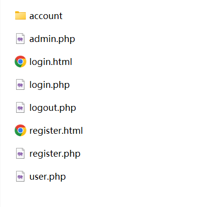

#### 操作指南

##### phpStudy集成环境

&emsp;&emsp;在网站根目录 WWW/ 下创建目录（如demo/）用于存放相关文件，示例：

&emsp;&emsp;如果使用文件版 login.php 和 register.php ，请在 demo/ 目录下创建 account/ 目录用于存放用户信息。

&emsp;&emsp;如果使用数据库版 login.php 和 register.php ，请创建 user_information 数据库，并在该数据库下创建 register 数据表，该表含 username 和 password 两个属性。同时，记得在这两个 php 文件里修改你的 MySQL 连接 url 、用户名和密码。

&emsp;&emsp;当然你可按自己的喜好命名目录、数据库、数据表等，只需要找到我预设的名字（如account、user_information），然后修改为你的即可。

&emsp;&emsp;访问 `localhost/demo/login.html` 即可！

#### NOTICE

- 这不是最终成品，后续还会改进！
- 如有 bug ，请通过 issue 方式告诉我，thanks！
- 项目虽小，欢迎您的参与！

#### 下一步计划

- 文件版登录不会检查用户密码，待增加。
- 数据库版注册不会检查用户是否已存在，待增加。
- 添加 CSS、JS 润色。
- 推出 Java 版。
- 增加更多功能。
